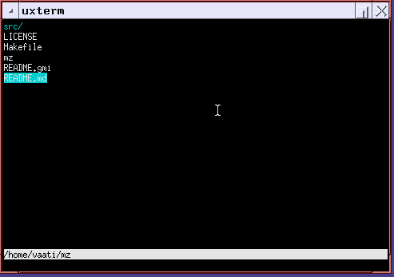

# mz

Terminal file manager with a vim-like interface

## Keybindings

* k	- up
* j	- down
* l	- enter a folder, or open a file
* h	- go to the parent folder
* e	- edit a file, require the $EDITOR environment variable to be set
* G	- make the cursor go to the first element of the list
* gg	- make the cursor go to the last element of the list
* gt	- go to the next tab
* gT	- go to the previous tab
* n	- select the next file matching the search
* N	- select the previous file matching the search
* .	- toggle the view on hidden folders and files
* yy	- copy the path of the selected file, using xclip or tmux
* space	- select file
* c	- copy selected files
* x	- cut selected files
* p	- paste selected files
* d	- delete selected files
* r	- restore selected files from the trash
* :	- enter command mode
* /	- enter search mode

## Commands

* :sh		- open a shell in the current folder using $SHELL
* :![command]	- run a shell command in the current folder, example :!mkdir test
* :nt		- open a new tab
* :q		- close the current tab
* :qa		- close all tabs
* :trash	- open trash in a new tab
* :trash clear	- permanently delete every files in the trash

## Build instruction

Simply clone the repository and run the command "make"

## Supported platforms

Known to build and run on the following platforms :
* Linux
* DragonFlyBSD
* FreeBSD
* OpenBSD
* NetBSD
* Illumos
